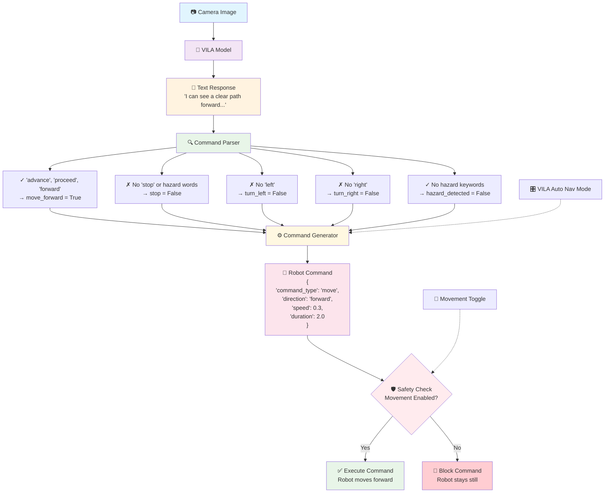

# VILA → Robot Movement Pipeline Diagram

This diagram shows exactly how the VILA vision-language model controls robot movement through a 5-step process.

## Mermaid Diagram

## How to Use This File

1. **GitHub/GitLab**: This will render automatically in markdown files
2. **VS Code**: Install the "Markdown Preview Mermaid Support" extension
3. **Online**: Copy the code block to https://mermaid.live/
4. **Export**: Use mermaid-cli to convert to PNG/SVG: `mmdc -i VILA_ROBOT_PIPELINE_DIAGRAM.md -o pipeline.png`

## Pipeline Steps Explained

1. **📷 Camera Image**: Robot's camera captures environment
2. **🤖 VILA Model**: AI analyzes image and generates natural language response
3. **📝 Text Response**: VILA describes what it sees in human language
4. **🔍 Command Parser**: Uses flexible keyword detection (15+ forward patterns, hazard detection)
5. **⚙️ Command Generator**: Converts boolean flags to specific robot commands
6. **🛡️ Safety Check**: Multiple safety layers verify command is safe to execute
7. **🤖 Execute/Block**: Robot either moves or command is blocked for safety

This diagram shows the complete flow from vision to action in your robot system!